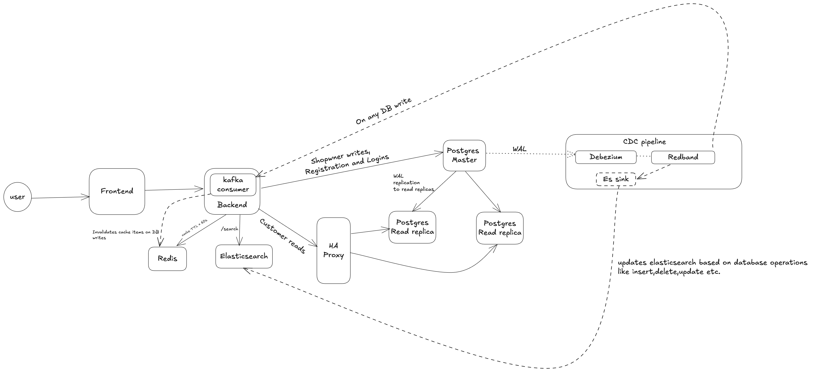
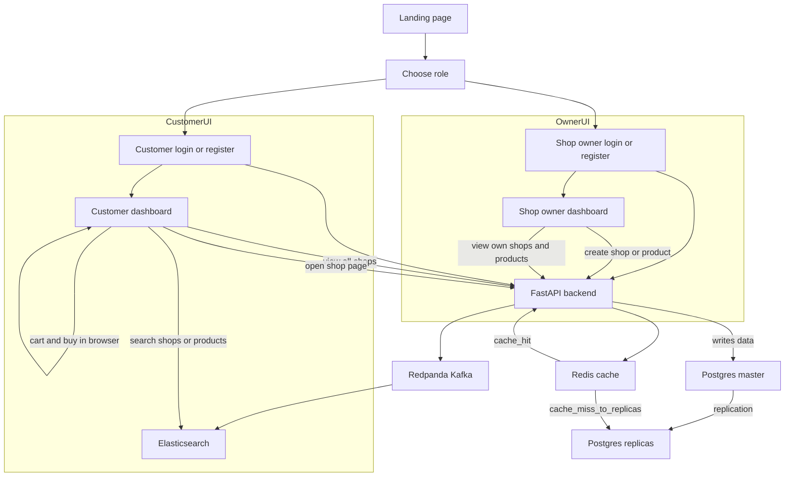

# Introduction
This project is inspired by the book (Accidental CTO)[https://github.com/subhashchy/The-Accidental-CTO]. The project integrated the early engineering design decisions made by Subash and his team. After reading the book found the motivation to work with redis and apache kafka like distributed log as only used it at the time of writing never found opportunity to work with them.

# Kirana Ghar – Architecture & Flow



## 1. App Flow Overview




---
## 2. Services in `docker-compose.yml`

### Postgres

- `postgres-master` (Bitnami Postgres)
  - Env: `POSTGRESQL_USERNAME=groceryuser`, `POSTGRESQL_PASSWORD=grocerypass`, `POSTGRESQL_DATABASE=grocerydb`.
  - Streaming replication configured via `repl_user` / `repl_pass` (created by Bitnami).
  - Logical decoding enabled for Debezium: `POSTGRESQL_WAL_LEVEL=logical`, etc.
  - Mounts `db/init/001_debezium.sql` into `/docker-entrypoint-initdb.d` to grant privileges to `repl_user` at first init.

- `postgres-replica-1`, `postgres-replica-2`
  - Bitnami Postgres replicas that follow `postgres-master`.
  - Used only for read queries (no writes from the app).

### Read load balancing

- `haproxy-read`
  - Listens on `5439`.
  - Backend `bk_read`:
    - `postgres-replica-1` and `postgres-replica-2` as primary read targets.
    - `postgres-master` marked as `backup` (used only if replicas are unavailable).
  - Backend read pool points here, so most reads go to replicas.

### Kafka / CDC

- `redpanda`
  - Kafka‑compatible broker on `redpanda:9092` (and `localhost:9092` on host).
  - Stores Connect internal topics (`connect-configs`, `connect-offsets`, `connect-status`) and Debezium topics:
    - `kirana.public.shops`
    - `kirana.public.products`.

- `kafka-connect` (Debezium Connect image)
  - Runs Kafka Connect distributed worker.
  - Plugin path includes Debezium and the Elasticsearch sink (mounted via `connect/plugins`).
  - REST UI on `localhost:8083` for managing connectors.
  - Two connectors are used:
    - **Source:** `kirana-pg-source` – Debezium Postgres connector.
    - **Sink:** `kirana-es-sink` – Confluent Elasticsearch sink.

### Elasticsearch & Kibana

- `elasticsearch`
  - Single‑node ES 8.x at `http://localhost:9200`.
  - Holds indexes:
    - `kirana-shops` (from topic `kirana.public.shops`)
    - `kirana-products` (from topic `kirana.public.products`).

- `kibana`
  - UI at `http://localhost:5601` wired to that ES node (handy for exploring indexes).

### Application services

- `backend`
  - Builds from `backend/Dockerfile`.
  - Exposes FastAPI app on `localhost:8000`.
  - Env:
    - `DATABASE_URL_WRITE` → `postgres-master:5432`
    - `DATABASE_URL_READ` → `haproxy-read:5439`
    - `ES_URL` → `http://elasticsearch:9200`
    - `REDIS_URL` → `redis://redis:6379/0`
    - `KAFKA_BOOTSTRAP_SERVERS` → `redpanda:9092`

- `frontend`
  - Builds the React app (Create React App).
  - Served via Nginx on `localhost:3000`.
  - Nginx is configured with a SPA fallback (all routes → `index.html`), so client‑side routes like `/shopowner-login` work.

---

## 3. Backend: Read/Write Split, Cache & Auth

File: `backend/app/main.py`

### DB pools

- `database_write = Database(DATABASE_URL_WRITE)`
  - Used for all writes & DDL (INSERT/UPDATE/DELETE, CREATE TABLE, etc.).
  - Points to `postgres-master`.

- `database_read = Database(DATABASE_URL_READ)`
  - Used for general reads (SELECTs).
  - Points to HAProxy → replicas.

### Redis cache & Kafka‑driven invalidation

- Redis:
  - URL: `REDIS_URL` (default `redis://redis:6379/0`).
  - Used for customer‑facing list endpoints:
    - `GET /shops/` for customers:
      - Cache key: `shops:customer`.
      - On cache hit → serve from Redis.
      - On miss → read from replicas and set cache with a short TTL (60s).
    - `GET /shops/{shop_id}/products/` for customers:
      - Cache key: `products:{shop_id}`.
      - Same pattern (hit → Redis, miss → replicas + cache set).

- Kafka consumer (in backend):
  - Subscribes to Debezium topics:
    - `kirana.public.shops`
    - `kirana.public.products`.
  - For each CDC event:
    - If a shop changes:
      - Invalidates `shops:customer`.
      - Also invalidates `products:{shop_id}` for that shop.
    - If a product changes:
      - Invalidates `products:{shop_id}`.
  - This means cache is refreshed on the next read, without waiting purely on TTL.
  - You will see logs such as:
    - `CDC event from topic kirana.public.shops (...): invalidated Redis keys [...]`.

### Read‑your‑own‑writes

- `authenticate_user()` uses `get_user(..., use_master=True)`:
  - Ensures a user can log in immediately after registering (no replica lag issues).

- `GET /shops/`:
  - If `role == "shopowner"` → master, filtered to owner’s shops.
  - Else (customer) → replicas, returns all shops.

- `GET /shops/{id}/products/`:
  - Shop owners read their own shop from master (fresh).
  - Customers read any shop’s products via replicas.

### Auth endpoints

- `POST /register`
  - Creates a new user with `username`, `password`, `role`, `full_name`, `address`, `mobile`.
  - Data stored in `users` table on master.

- `POST /token`
  - Accepts form (`username`, `password`), verifies against master, returns `access_token = username`.

- `GET /me`
  - Uses the bearer token (username) to return `{username, role, full_name, address, mobile}`.

---

## 4. Backend: Search (Elasticsearch)

### ES client

- `AsyncElasticsearch(ES_URL)` initialized in `startup()`.
- On failure (client or ES not ready), `es` remains `None` and `/search` returns 503.

### Index names

- Defaults (overridable via env):
  - `ES_INDEX_SHOPS = "kirana.public.shops"`
  - `ES_INDEX_PRODUCTS = "kirana.public.products"`

These match the actual indexes that the ES sink creates (because we use `topic.index.map` with the original topic names).

### `/search` endpoint

- Signature:
  - `GET /search?q=...&type=all|shop|product&city=...&size=...`
- Behavior:
  - Validates that `es` is available; if not → 503.
  - Chooses indices based on `type`:
    - `shop` → `kirana.public.shops`
    - `product` → `kirana.public.products`
    - `all` (default) → both.
  - Builds a `bool` query with:
    - `multi_match` over fields: `name^3`, `shop_name^2`, `shop_city` with fuzziness.
    - Optional `city` filter matching either `city.keyword` or `shop_city.keyword`.
  - Calls `es.search(...)`:
    - If indices are missing (index_not_found_exception) → logs and returns `{count: 0, results: []}`.
    - For other errors → logs and returns 503.
  - Returns flattened doc list with `_index`, `_id`, `_score`, plus `_source` fields.

Because ES is kept in sync by CDC (see next section), `/search` trusts ES as the source of truth for search results and does not re‑check rows in Postgres.

---

## 5. CDC: Postgres → Redpanda → Kafka Connect → Elasticsearch

### Debezium Postgres Source (`kirana-pg-source`)

File: `connect/connectors/pg-source.json`

- Connector class: `io.debezium.connector.postgresql.PostgresConnector`.
- Connects to `postgres-master` using `repl_user` / `repl_pass`.
- Uses logical decoding plugin `pgoutput` and slot `kirana_slot`.
- Publication:
  - Name: `dbz_publication` (created/managed by backend on startup).
  - `publication.autocreate.mode`: `disabled` (we let the app ensure it exists).
- Tables included:
  - `public.shops`
  - `public.products`
- Transforms:
  - `ExtractNewRecordState` unwraps the Debezium envelope and drops tombstones.
  - `delete.handling.mode=rewrite` so deletes become records with the same key and `value=null`.

Resulting topics in Redpanda:

- `kirana.public.shops`
- `kirana.public.products`

### Elasticsearch Sink (`kirana-es-sink`)

File: `connect/connectors/es-sink.json`

- Connector class: `io.confluent.connect.elasticsearch.ElasticsearchSinkConnector`.
- Consumes from topics:
  - `kirana.public.shops`
  - `kirana.public.products`
- Important config:
  - `"connection.url": "http://elasticsearch:9200"`
  - `"key.ignore": "false"` → ES uses the Kafka record key as document `_id`.
  - `"schema.ignore": "true"` → schemaless JSON.
  - `"behavior.on.null.values": "delete"` → deletes documents when value is `null`.
  - `"topic.index.map": "kirana.public.shops:kirana-shops,kirana.public.products:kirana-products"`
  - `"transforms": "extractKey"` with `"transforms.extractKey.field": "id"` so the Debezium key struct becomes the simple `id` string used as `_id`.

End‑to‑end behavior:

- INSERT / UPDATE in Postgres:
  - Debezium emits record with key `{id: ...}` and value containing the latest row.
  - ES sink upserts document `_id = id` into `kirana-shops` or `kirana-products`.
- DELETE in Postgres:
  - Debezium, with `delete.handling.mode=rewrite`, emits record with same key and `value=null`.
  - ES sink sees `null` value and, with `behavior.on.null.values=delete`, deletes the document with that `_id`.

As a result, Elasticsearch stays in sync with Postgres for shops and products, including deletions.

---

## 6. Frontend Flows

### Authentication & header

- `App.js`:
  - Stores `token` (from `/token`) in `localStorage`.
  - Calls `/me` on startup or token change to get user info (`username`, `role`, `full_name`).
  - Routes:
    - `/shopowner-login`, `/customer-login` → show role‑specific `Login` component if no token; otherwise redirect.
    - `/shopowner-dashboard` for shop owners.
    - `/customer-dashboard` and `/shop/:id` for customers.
  - Header shows:
    - Brand logo + “Kirana Ghar” subtitle.
    - “Welcome {full_name}” when logged in.
    - Logout button (clears token & localStorage).

### Shop owner dashboard

File: `frontend/src/ShopOwnerDashboard.js`

- Allows owners to:
  - Create shops (`name`, `city`) via `POST /shops/`.
  - List their shops via `GET /shops/` (owner‑filtered).
  - Select a shop and add products (`name`, `price`) via `POST /shops/{shop_id}/products/`.

### Customer dashboard & search

File: `frontend/src/CustomerDashboard.js`

- Shows:
  - Logout button.
  - Search bar (new):
    - Input → `/search?q=...&type=all&size=20` with bearer token.
    - Displays shop and product hits:
      - Shop hits: “Shop: {name — city}”, clicking navigates to `/shop/{id}`.
      - Product hits: “Product: {name} – ₹price”, with “View shop” button → `/shop/{shop_id}`.
  - “All Shops” list:
    - Calls `GET /shops/` to list all shops (for customers).
    - Each entry links to `/shop/{id}` and passes the shop via React Router `state`.

### Shop products page & cart

File: `frontend/src/ShopProducts.js`

- For a given shop (`/shop/:id`):
  - Fetches `GET /shops/{id}` and `GET /shops/{id}/products/`.
  - Displays product list with:
    - “Buy Now” (just an alert; no payment integration).
    - “Add to Cart”.
  - Cart:
    - Stored in `sessionStorage` (per browser tab).
    - Shows items with quantity, total per item, plus:
      - “Buy Cart” (clears cart and alerts total).
      - “Clear Cart”.
      - `+` / `-` controls per item.

---

## 7. Running the Stack

### First‑time setup

1. Start everything from a clean slate:

```bash
docker compose down -v
docker compose up -d --build
```

2. Wait for services:

```bash
docker compose ps
```

You should see master/replicas healthy, redpanda, kafka-connect, elasticsearch, backend, frontend all running.

3. Register connectors (once):

```bash
chmod +x scripts/register_connectors.sh
./scripts/register_connectors.sh
```

Check:

```bash
curl http://localhost:8083/connectors
curl http://localhost:8083/connectors/kirana-pg-source/status | jq
curl http://localhost:8083/connectors/kirana-es-sink/status | jq
```

Both should show `connector.state: RUNNING` and task state `RUNNING`.

### Seed demo data

With backend and connectors running:

```bash
python scripts/seed_sample_data.py
```

This will:

- Register multiple Indian shop owners and customers.
- Create shops with cities across India.
- Add products to each shop.

Debezium will stream these inserts to Redpanda, and the ES sink will index them into Elasticsearch.

### Try the app

- Frontend: `http://localhost:3000`
- Backend (Swagger): `http://localhost:8000/docs`
- Elasticsearch health: `http://localhost:9200/_cluster/health`

**As a shop owner:**

- Go to `/shopowner-login`, log in with one of the seeded owner accounts (password defaults to `Pass@1234` in the seed script).
- Create a new shop; add some products.

**As a customer:**

- Go to `/customer-login`, log in as a seeded customer.
- Use the search bar on the Customer Dashboard to find shops/products.
- Click into a shop → `/shop/:id`, add products to cart, “Buy Now” or “Buy Cart”
